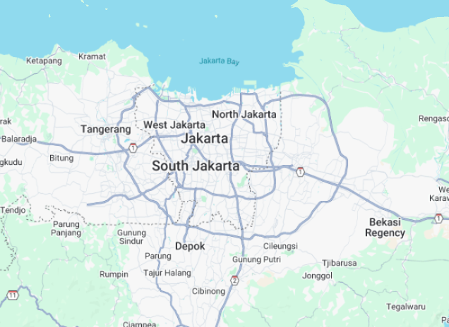
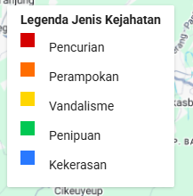
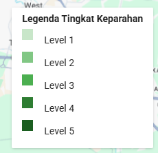
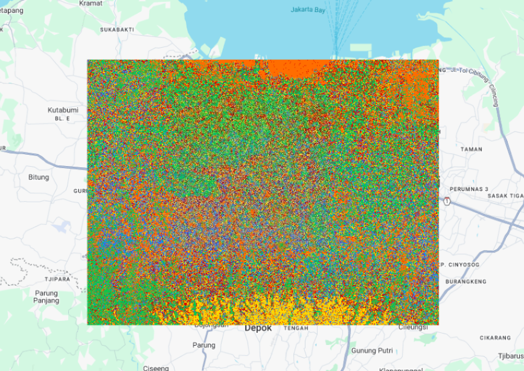
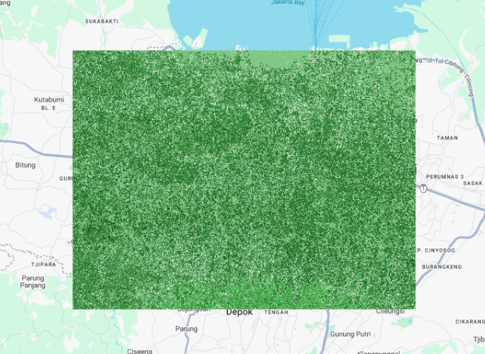
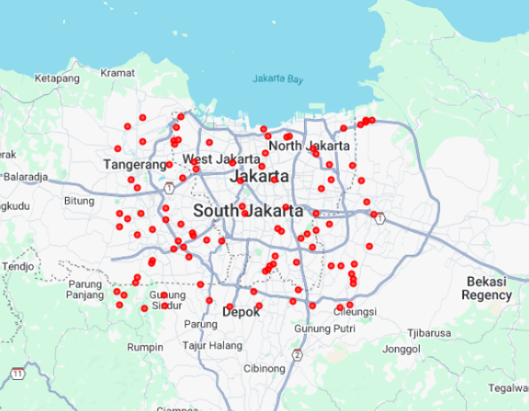

# Analisis Pola Kejahatan di Jakarta dengan Google Earth Engine

## Deskripsi Program

Program ini merupakan implementasi analisis pola kejahatan di Jakarta menggunakan Google Earth Engine (GEE) dengan pendekatan machine learning. Program dirancang untuk mengidentifikasi pola dan memprediksi jenis kejahatan serta tingkat keparahannya berdasarkan variabel lingkungan dengan memanfaatkan kemampuan komputasi geospasial GEE.

# Visualisasi Hasil

Berikut adalah visualisasi terkait studi kejahatan:

| Area Studi | Legenda Jenis Kejahatan | Legenda Tingkat Keparahan |
|------------|-------------------------|----------------------------|
|  |  |  |

| Prediksi Jenis Kejahatan | Prediksi Tingkat Keparahan | Simulasi Data Kejahatan |
|--------------------------|----------------------------|--------------------------|
|  |  |  |


## Struktur dan Fungsi Kode

### 1. Pendefinisian Area Studi
```javascript
var jakarta = ee.Geometry.Rectangle([106.6, -6.4, 107.0, -6.1]);
Map.centerObject(jakarta, 11);
```
**Penjelasan**: 
- Membuat objek geometri persegi panjang yang mewakili area Jakarta
- Koordinat menunjukkan batas area: 106.6°-107.0° BT dan -6.4°-(-6.1)° LS
- Memusatkan tampilan peta pada objek dengan tingkat zoom 11

### 2. Simulasi Data Kejahatan
```javascript
var crimes = ee.List(['Pencurian', 'Perampokan', 'Vandalisme', 'Penipuan', 'Kekerasan']);
var randomImage = ee.Image.random().multiply(5).int();

var sampledPoints = randomImage.sample({
  region: jakarta,
  geometries: true,
  scale: 30,
  numPixels: 100
});

var crimeData = sampledPoints.map(function(feature) {
  var id = ee.Number(feature.get('random')).int();
  return feature.set({
    'crime_type_id': id,
    'crime_type': crimes.get(id),
    'severity': id.add(1),
    'year': 2023,
    'month': ee.Number(ee.Image.random().multiply(12).add(1).floor())
  });
});
```
**Penjelasan**:
- Mendefinisikan 5 jenis kejahatan dalam daftar `crimes`
- Membuat citra acak dan mengubahnya menjadi nilai integer 0-4
- Mengambil sampel 100 titik dari citra di wilayah Jakarta pada skala 30 meter
- Menetapkan atribut untuk setiap titik: jenis kejahatan, tingkat keparahan, tahun, dan bulan

### 3. Pengumpulan Data Lingkungan
```javascript
// LANDCOVER
var landcover = ee.ImageCollection('ESA/WorldCover/v100')
  .filterDate('2020-01-01', '2021-12-31')
  .first()
  .select('Map')
  .rename('landcover')
  .clip(jakarta);

// POPULATION
var populationRaw = ee.ImageCollection('JRC/GHSL/P2023A/GHS_POP')
  .filterDate('2020-01-01', '2020-12-31')
  .first();
var population = populationRaw.select('population_count').rename('population').clip(jakarta);

// ELEVATION
var elevation = ee.Image('USGS/SRTMGL1_003').clip(jakarta);

// DISTANCE (simulasi)
var distToRoads = ee.Image.random().multiply(5000).clip(jakarta).rename('dist_to_roads');
var distToPolice = ee.Image.random().multiply(10000).clip(jakarta).rename('dist_to_police');
var distToSchools = ee.Image.random().multiply(8000).clip(jakarta).rename('dist_to_schools');
```
**Penjelasan**:
- **Landcover**: Mengambil data tutupan lahan dari ESA WorldCover tahun 2020-2021
- **Population**: Mengambil data kepadatan penduduk dari Global Human Settlement Layer
- **Elevation**: Mengambil data elevasi dari SRTM (Shuttle Radar Topography Mission)
- **Distance**: Mensimulasikan jarak ke jalan, kantor polisi, dan sekolah menggunakan citra acak

### 4. Penggabungan Variabel
```javascript
var features = ee.Image.cat([
  landcover,
  population,
  elevation.rename('elevation'),
  distToRoads,
  distToPolice,
  distToSchools
]);
```
**Penjelasan**:
- Menggabungkan semua variabel lingkungan menjadi satu citra multi-band
- Setiap band mewakili satu variabel prediktor

### 5. Penyiapan Data Training
```javascript
var trainingData = features.sampleRegions({
  collection: crimeData,
  properties: ['crime_type_id', 'severity'],
  scale: 30
});

var withRandom = trainingData.randomColumn();
var train = withRandom.filter(ee.Filter.lt('random', 0.7));
var valid = withRandom.filter(ee.Filter.gte('random', 0.7));
```
**Penjelasan**:
- Mengekstrak nilai variabel lingkungan pada titik-titik kejahatan
- Membuat kolom acak untuk memisahkan data
- Membagi data menjadi set training (70%) dan validasi (30%)

### 6. Pelatihan Model Machine Learning
```javascript
var decisionTree = ee.Classifier.smileCart().train({
  features: train,
  classProperty: 'crime_type_id',
  inputProperties: features.bandNames()
});

var randomForest = ee.Classifier.smileRandomForest(50).train({
  features: train,
  classProperty: 'crime_type_id',
  inputProperties: features.bandNames()
});

var severityModel = ee.Classifier.smileRandomForest(50).train({
  features: train,
  classProperty: 'severity',
  inputProperties: features.bandNames()
});
```
**Penjelasan**:
- **Decision Tree**: Menggunakan algoritma CART (Classification and Regression Trees)
- **Random Forest**: Menggunakan ensemble 50 pohon keputusan untuk prediksi jenis kejahatan
- **Severity Model**: Menggunakan Random Forest untuk memprediksi tingkat keparahan

### 7. Prediksi dan Klasifikasi
```javascript
var predCrime = features.classify(randomForest);
var predSeverity = features.classify(severityModel);
```
**Penjelasan**:
- Menerapkan model Random Forest untuk memprediksi jenis kejahatan pada seluruh area
- Menerapkan model tingkat keparahan pada seluruh area studi

### 8. Visualisasi Hasil
```javascript
Map.addLayer(crimeData, {color: 'red'}, 'Data Kejahatan');

var crimePalette = ['#D50000', '#FF6D00', '#FFD600', '#00C853', '#2979FF'];
Map.addLayer(predCrime, {min: 0, max: 4, palette: crimePalette}, 'Prediksi Jenis Kejahatan');

var severityPalette = ['#C8E6C9', '#81C784', '#4CAF50', '#2E7D32', '#1B5E20'];
Map.addLayer(predSeverity, {min: 1, max: 5, palette: severityPalette}, 'Prediksi Tingkat Keparahan');
```
**Penjelasan**:
- Menampilkan titik-titik data kejahatan di peta
- Menampilkan hasil prediksi jenis kejahatan dengan palet warna berbeda
- Menampilkan hasil prediksi tingkat keparahan dengan gradasi warna hijau

### 9. Pembuatan Legenda
```javascript
var legendCrime = ui.Panel({
  style: {
    position: 'bottom-left',
    padding: '8px 15px'
  }
});
// (Kode untuk isi legenda)
Map.add(legendCrime);

var legendSeverity = ui.Panel({
  style: {
    position: 'bottom-right',
    padding: '8px 15px'
  }
});
// (Kode untuk isi legenda)
Map.add(legendSeverity);
```
**Penjelasan**:
- Membuat panel UI untuk legenda jenis kejahatan di kiri bawah
- Membuat panel UI untuk legenda tingkat keparahan di kanan bawah
- Menambahkan kedua legenda ke peta

## Konsep dan Definisi

### Google Earth Engine (GEE)
Platform komputasi geospasial berbasis cloud yang dikembangkan Google untuk memproses dan menganalisis data geospasial dalam skala besar dengan akses ke katalog data publik yang luas.

### Machine Learning dalam Konteks Geospasial
Teknik yang memungkinkan komputer "belajar" dari data untuk mengidentifikasi pola dan membuat prediksi. Dalam konteks geospasial, machine learning digunakan untuk menganalisis hubungan antara fenomena (seperti kejahatan) dengan karakteristik spasial lingkungan.

### Decision Tree (CART)
Algoritma machine learning yang membangun model prediktif berbentuk struktur pohon. Model ini memecah data menjadi subset yang semakin kecil berdasarkan variabel prediktor.

### Random Forest
Algoritma ensemble yang menggunakan banyak pohon keputusan untuk menghasilkan prediksi yang lebih akurat dan mengatasi masalah overfitting pada pohon keputusan tunggal.

### Data Geospasial yang Digunakan

#### Tutupan Lahan (Land Cover)
Klasifikasi fisik material di permukaan bumi (seperti vegetasi, air, area terbangun). Dataset ESA WorldCover menyediakan peta tutupan lahan global dengan resolusi 10 meter.

#### Kepadatan Penduduk
Mengukur jumlah penduduk per unit area. Data dari Global Human Settlement Layer (GHSL) menyediakan informasi distribusi populasi global.

#### Elevasi
Ketinggian suatu lokasi di atas permukaan laut. Data SRTM (Shuttle Radar Topography Mission) menyediakan informasi elevasi global dengan resolusi sekitar 30 meter.

## Pentingnya Analisis Ini

Program ini menunjukkan bagaimana teknologi penginderaan jauh dan machine learning dapat diterapkan untuk analisis kriminologi lingkungan. Meskipun menggunakan data simulasi, pendekatan ini mengilustrasikan potensi untuk:

1. Mengidentifikasi faktor lingkungan yang berkorelasi dengan jenis kejahatan tertentu
2. Memprediksi area berisiko tinggi untuk berbagai jenis kejahatan
3. Mendukung alokasi sumber daya keamanan yang lebih efisien
4. Membantu perencanaan kota untuk menciptakan lingkungan yang lebih aman
